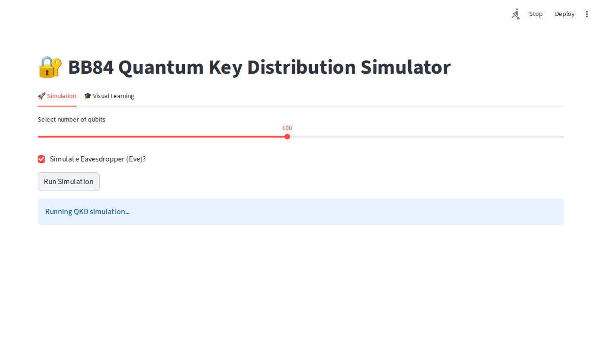
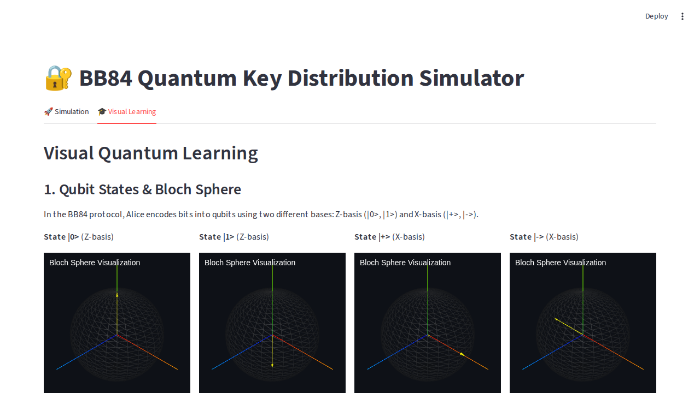

# BB84 Quantum Key Distribution Simulator

Simulate the BB84 protocol to demonstrate how two parties (Alice and Bob) can generate a shared secret key securely, even if a third party (Eve) tries to eavesdrop.

## Visual Quantum Learning
This simulator includes interactive visualizations to help understand quantum mechanics and the BB84 protocol:
- **Bloch Sphere**: Visualize qubit states in 3D.
- **Photon Animation**: See qubits traveling from Alice to Bob.
- **Basis Matching**: Understand how keys are sifted.




## Phase 1 — Clean Core BB84 Simulator
Phase 1 focuses on a clean, modular architecture and enhanced visualizations.

### Features
- **Modular Core**: Decoupled protocol logic, simulation engine, and UI.
- **Protocols**: Supports both BB84 and B92.
- **Eavesdropping**: Simulate various attacks (Intercept-Resend, Noisy Channel, PNS).
- **Post-Processing**: Integrated Error Correction (Cascade) and Privacy Amplification.
- **Enhanced Visuals**: Real-time quantum circuits, Bloch sphere states, and interactive photon animations.

### Project Structure
- `core/`: Quantum logic, protocols, and simulation engine.
- `app.py`: Streamlit frontend.
- `visuals.py`: Interactive D3/Three.js and Matplotlib visualizations.
- `tests/`: Automated unit and UI tests.

## Installation
```bash
pip install -r requirements.txt
playwright install chromium
streamlit run app.py
```

## Running Tests
To run the automated test suite (including UI tests):
```bash
PYTHONPATH=. python3 -m pytest
```
