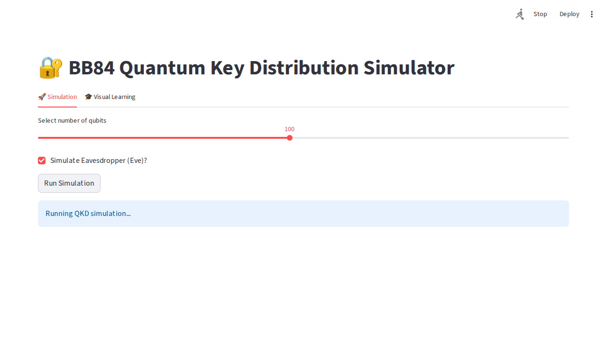
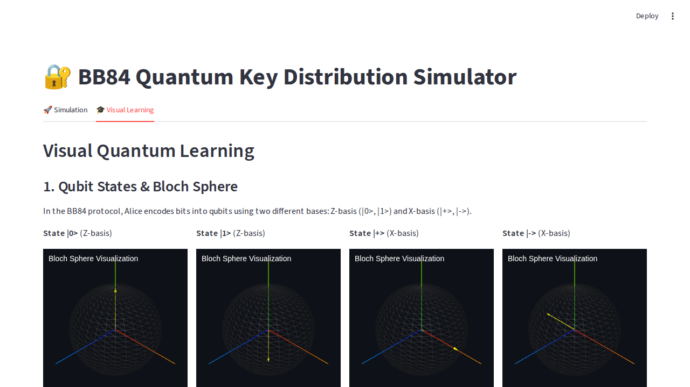

# BB84 Quantum Key Distribution Simulator

Simulate the BB84 protocol to demonstrate how two parties (Alice and Bob) can generate a shared secret key securely, even if a third party (Eve) tries to eavesdrop.

## Visual Quantum Learning
This simulator includes interactive visualizations to help understand quantum mechanics and the BB84 protocol:
- **Bloch Sphere**: Visualize qubit states in 3D.
- **Photon Animation**: See qubits traveling from Alice to Bob.
- **Basis Matching**: Understand how keys are sifted.




## Features & Architecture (Phase 1 Clean Core)

- **Modular Architecture**: Clean separation between core QKD protocols (`core/bb84.py`, `core/b92.py`), eavesdropper attack models (`core/attacks.py`), simulation engine orchestration (`core/engine.py`), error analysis & statistics (`core/stats.py`), and post-processing (`core/reconciliation.py`, `core/privacy.py`).
- **Alice & Bob Key Generation**: Random bit generation and basis selection (Z and X bases).
- **Quantum Circuit Generation & Simulation**: Circuit construction using Qiskit and execution via AerSimulator.
- **Key Sifting & Error Analysis**: Basis matching comparison, key sifting, and Quantum Bit Error Rate (QBER) calculation.
- **Eve Attack Simulation**: Intercept-Resend attack model with configurable probability, Noisy Channel model, and Photon Number Splitting attack.
- **Interactive Streamlit UI**: Real-time simulation status, side-by-side quantum circuit drawing, 3D Bloch sphere renders, photon transmission animations, and detailed error reports.
- **CLI Runner**: Command-line simulation execution.

## Installation & Running

1. **Install Dependencies**:
   ```bash
   pip install -r requirements.txt
   ```

2. **Run Streamlit Application**:
   ```bash
   streamlit run app.py
   ```

3. **Run Command Line Interface (CLI)**:
   ```bash
   python qkd_cli_runner.py --qubits 100 --protocol BB84 --attack Intercept-Resend --noise 0.2
   ```

4. **Run Tests**:
   ```bash
   PYTHONPATH=. python3 -m pytest
   ```
